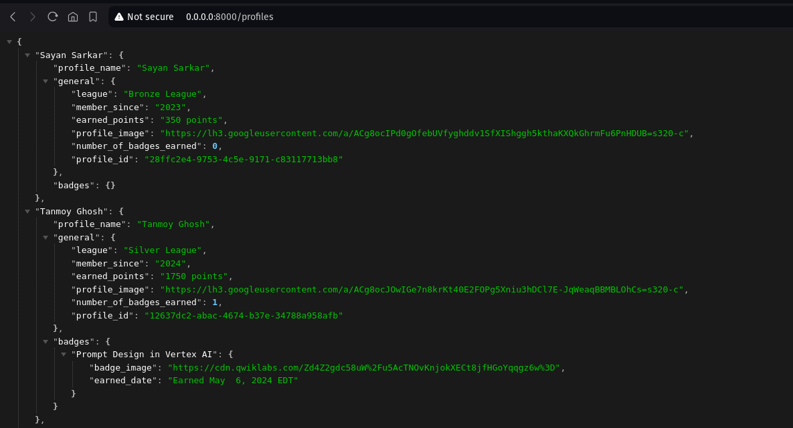
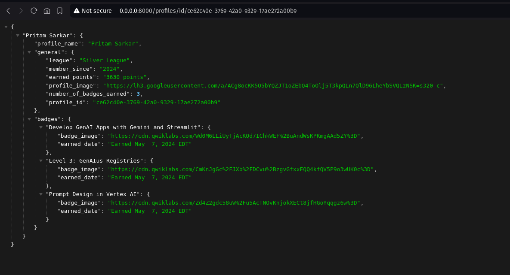

# gcsbtracker-backend
A backend service written in python that scrapes Google Cloud Skills Boost profiles to track skill badges and arcade game completions. The project leverages the Starlette framework for the backend API, along with a scheduler to periodically update profile data. Users can retrieve profile information through a RESTful API.

## Table of Contents
- [Description](#description)
- [Installation](#installation)
- [Usage](#usage)
- [Contributing](#contributing)
- [License](#license)
- [Support](#support)

## Features
- Scrapes Google Cloud Skills Boost profiles.
- Extracts detailed profile information, including:
    - Username
    - League
    - Membership duration
    - Earned points
    - Badges (with images and earned dates)
- Stores data in a JSON format for easy access.
- Provides an API to fetch all profiles or a specific profile by its ID.
- Includes a scheduler to automatically update profiles at specified intervals.
- Logging system for monitoring server activity.

## Project Structure

.
├── getData.py              # Script to read CSV, scrape profiles, and save to JSON
├── scraper.py              # Contains the Scraper class for scraping profile data
├── server.py               # The Starlette server for the API
├── requirements.txt        # List of project dependencies
└── profiles_data.json      # Output JSON file for profile data(generated)

## Requirements
- Python 3.7 or higher
- Required libraries listed in requirements.txt

To install the required libraries, run:

```bash
pip install -r requirements.txt
```

## Setup

1. Clone the repository.

```bash
git clone https://github.com/psypherion/gcsbtracker-backend.git
```

2. Navigate to the cloned directory.

```bash
cd gcsbtracker-backend
```

3. Install the required libraries.

```bash
pip install -r requirements.txt
```

4. Run the server.

```bash
uvicorn server:app
```

## Usage

To fetch all profiles, run:

```bash
curl http://localhost:8000/profiles
```

To fetch a specific profile by ID, run:

```bash
curl http://localhost:8000/profiles/id/{profile_id}
```

### in Browser

1. Navigate to http://localhost:8000/profiles/

2. Navigate to http://localhost:8000/profiles/id/{id}



## Contributing

If you'd like to contribute to the project, please follow these steps:

1. Create a pull request on GitHub.
2. Add the necessary changes to the README.md file.
3. Submit a pull request to the repository.

## License

This project is licensed under the BSD 2-Clause License

## Support

If you have any questions or feedback, please [open an issue](https://github.com/psypherion/gcsbtracker-backend/issues/new) or [open a pull request](https://github.com/psypherion/gcsbtracker-backend)